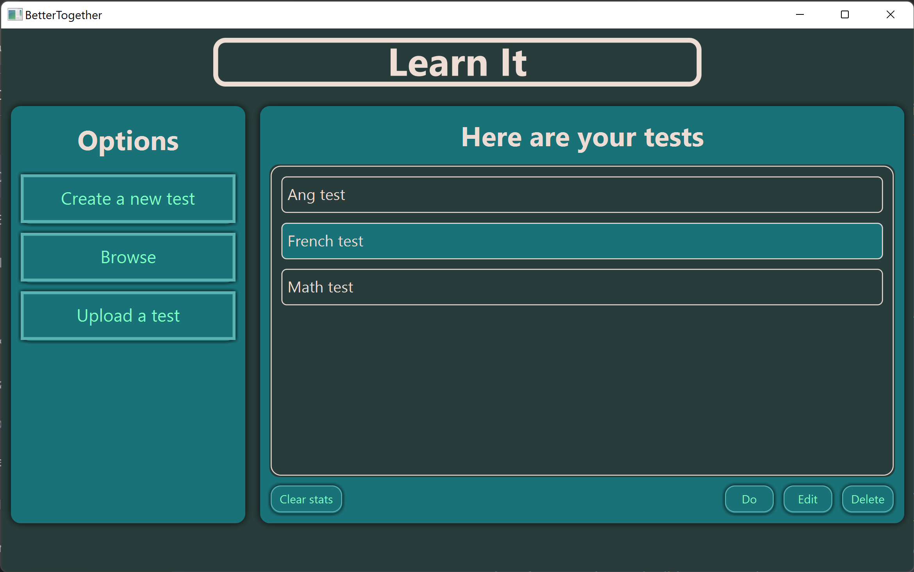
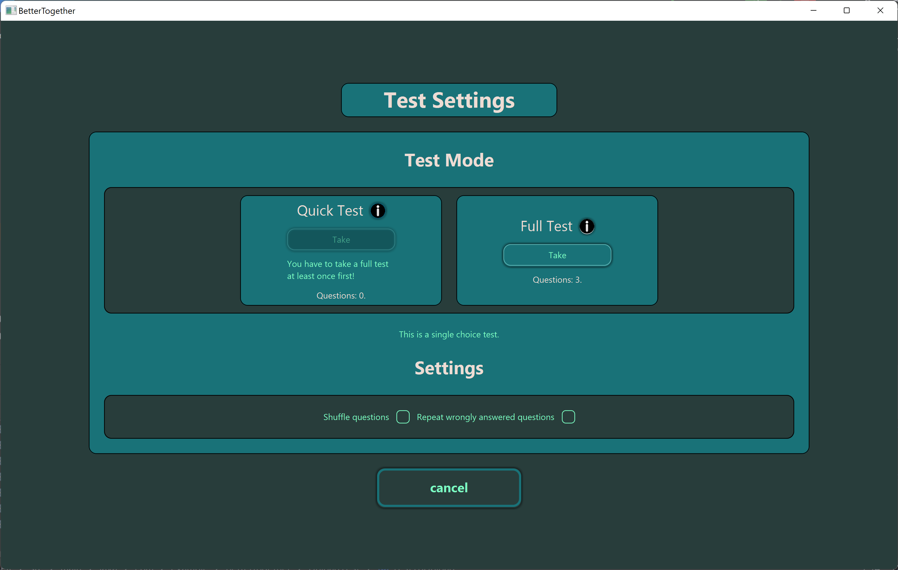
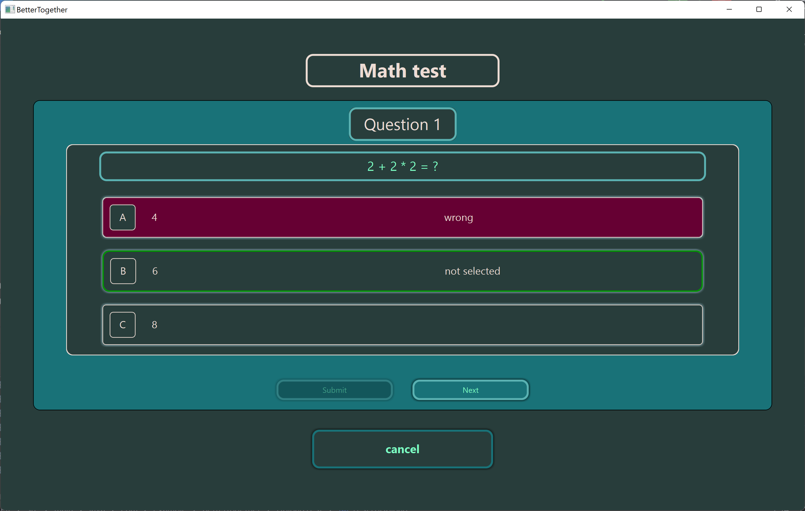
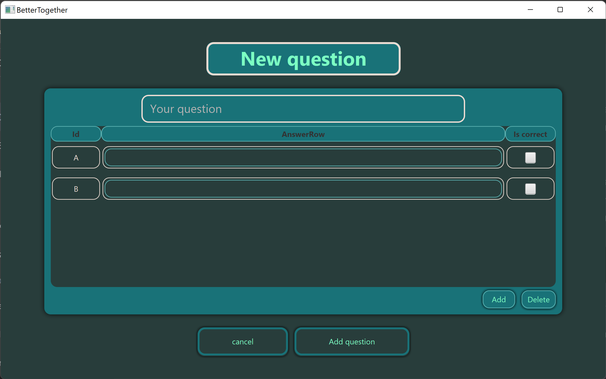
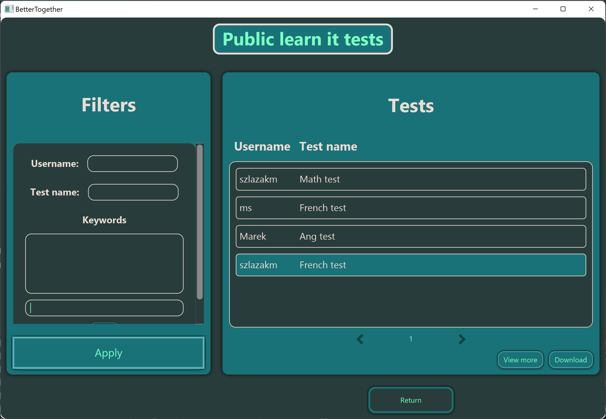

# TestYourself

## Table of Contents
- [About](#about)
- [Features](#features)
- [Screenshots](#screenshots)
- [Getting Started](#getting-started)
- [Usage](#usage)
- [Contributing](#contributing)
- [License](#license)

## About

TestYourself is a JavaFX desktop application designed to help users create, edit, and manage tests. It also includes features for test-taking in two modes: "Full Test" and "Quick Test." Users can upload tests to a public database for sharing with others.

## Features

- **Test Creation:** Create and edit tests with ease.
- **Test Modes:** Take tests in "Full Test" mode or "Quick Test" mode based on previous performance.
- **Performance Tracking:** The app stores data about test and question results.
- **Test Sharing:** Upload tests to a public database for others to download and use.

## Screenshots







## Getting Started

These instructions will help you get a copy of the project up and running on your local machine for development and testing purposes.

1. Clone the repository:
   ```bash
   git clone https://github.com/Michal-Szlazak/TestYourself.git
   ````
2. Navigate to the project directory:
   ````bash
   cd TestYourself
   ````
4. Install the required dependencies:
   ````bash
   mvn install
   ````
5. Run the application:
   ````bash
   mvn javafx:run
   ````
